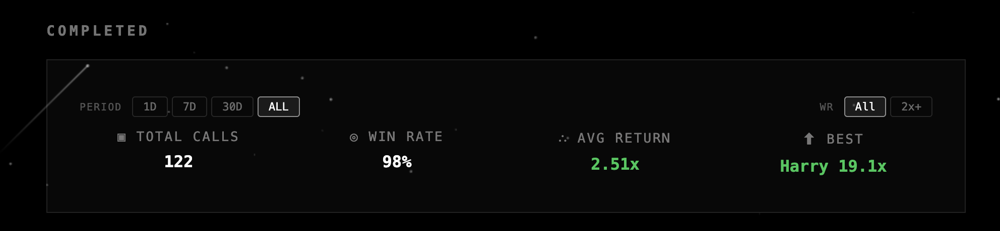
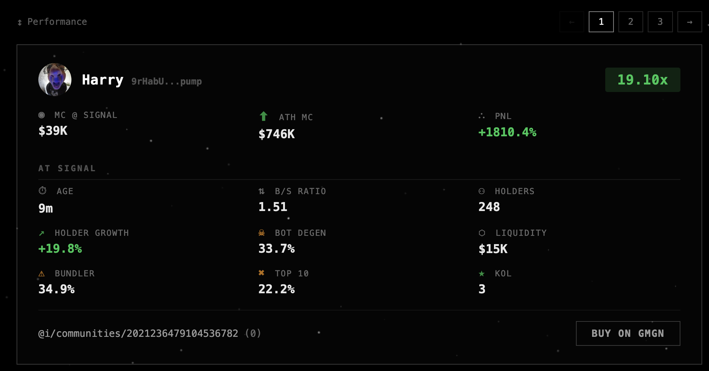
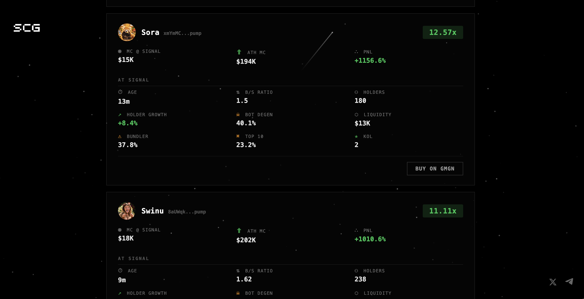

# SCG Alpha — Real-Time Solana Token Signal Platform

**Built on the GMGN Agent API**

SCG Alpha is a full-stack Solana token intelligence platform that discovers, filters, tracks, and trades pump.fun tokens in real-time. It combines GMGN's market data with multi-layer scam filtering and automated execution to surface high-conviction signals before they peak.

> **Live Dashboard:** [vault.scgalpha.com](https://vault.scgalpha.com) — 700+ unique visitors in the first week

---

## What It Does

```
GMGN Trending Scanner → Multi-Scan Tracking → Scam Filters → Live Dashboard + Auto-Trading
      (30s polls)          (5min watch)        (multi-layer)    (682 visitors)    (GMGN swap)
```

1. **Discover** — Polls GMGN `/v1/market/rank` every 30 seconds for trending Solana tokens
2. **Track** — Monitors tokens across 10+ consecutive scans, watching holder growth and liquidity stability
3. **Filter** — Applies multi-layer scam detection using GMGN security data (rug ratio, bundler rate, bot/degen wallets, entrapment, wash trading)
4. **Alert** — Publishes signals to a live public dashboard and Telegram channel with full on-chain metrics
5. **Trade** — Executes automated buys via GMGN `/v1/trade/swap` with server-side take-profit condition orders
6. **Track Returns** — Monitors price at 5m, 15m, 30m, 1hr intervals and records all-time-high post-signal

---

## Architecture

```
┌─────────────────────────────────────────────────────────────────────┐
│                         GMGN Agent API                              │
│  /v1/market/rank  /v1/token/info  /v1/token/security  /v1/trade/*  │
└──────┬──────────────────┬──────────────────┬──────────────┬─────────┘
       │                  │                  │              │
       ▼                  ▼                  ▼              ▼
┌──────────┐    ┌──────────────┐    ┌──────────────┐  ┌──────────┐
│ Scanner  │───▶│ Scam Filters │───▶│ Alert System │  │  Trader  │
│ (30s)    │    │ (multi-layer)│    │ (Dashboard)  │  │ (GMGN)   │
└──────────┘    └──────────────┘    └──────────────┘  └──────────┘
       │              │                    │                │
       ▼              ▼                    ▼                ▼
┌──────────┐    ┌──────────┐    ┌──────────────────┐  ┌──────────┐
│ Tracker  │    │ Verify   │    │ Price Tracker    │  │ Exit Mgr │
│ (5min)   │    │ (buy-time│    │ (5m/15m/30m/1h) │  │ (TP)     │
└──────────┘    └──────────┘    └──────────────────┘  └──────────┘
```

### Components

| Component | Description | GMGN Endpoints Used |
|-----------|-------------|-------------------|
| **Scanner** | Polls trending tokens every 30s, tracks across multiple scans | `/v1/market/rank` |
| **Tracker** | Monitors holder growth, liquidity stability over 5+ minutes | `/v1/market/rank` (scan data) |
| **Scam Filters** | Multi-layer filtering: rug ratio, entrapment, holder growth, bot %, bundler %, wash trading | `/v1/token/info`, `/v1/token/security` |
| **Alert System** | Publishes to live web dashboard + Telegram with full metrics snapshot | — |
| **Price Tracker** | Records price at 5m, 15m, 30m, 1hr + granular 30s journal | `/v1/token/info` |
| **ATH Watcher** | Monitors for 24h post-completion for understated returns | `/v1/token/info` |
| **Trader** | Buys via GMGN with server-side TP condition orders | `/v1/trade/swap`, `/v1/trade/query_order` |
| **Top Holder Analysis** | Analyzes top 20 holders for concentration risk | `/v1/market/token_top_holders` |
| **Top Trader Analysis** | Identifies smart money and whale activity | `/v1/market/token_top_traders` |
| **Analytics** | Tracks dashboard visitor behavior (page views, clicks, sessions) | — |

---

## GMGN API Integration Details

### 1. Discovery — Trending Scanner

```python
# Poll GMGN trending every 30 seconds
data = await api_get(session, "/v1/market/rank", {
    "chain": "sol",
    "type": "5m",
    "limit": 50
})

# Extract tokens with: holder_count, market_cap, volume, buys, sells,
# price_change_percent5m, liquidity, rug_ratio, entrapment_ratio,
# bundler_rate, bot_degen_rate, sniper_count, bluechip_owner_percentage,
# is_wash_trading, cto_flag, hot_level, and 20+ more fields
```

Tokens are tracked across **10+ consecutive scans** (~5 minutes) before qualifying. This scan-loop approach replaces expensive websocket connections and gives us holder growth trajectory data for free.

### 2. Filtering — Scam Detection

```python
# Fetch detailed security data
security = await api_get(session, "/v1/token/security", {
    "chain": "sol", "address": mint
})

# Multi-layer filters using GMGN data:
# - Rug ratio threshold
# - Entrapment ratio threshold
# - Bot/degen wallet percentage
# - Bundler trader volume percentage
# - Developer team hold rate
# - Top 10 holder concentration
# - Fresh wallet rate anomalies
# - Wash trading detection (B/S symmetry + volume)
# - Migration status verification
```

### 3. Qualification — Multi-Layer Filtering

Tokens must pass scam detection filters at both scan time and buy time using fresh GMGN data:

```python
# Scan-time filters (from /v1/market/rank trending data):
# - Developer team hold rate
# - Top 10 holder concentration
# - Parabolic 5m% rejection (buying the top)
# - Platform filter (pump.fun only)

# Buy-time filters (fresh /v1/token/info + /v1/token/security):
# - Bot/degen wallet rate (artificial holder inflation)
# - Bundler trader volume percentage (coordinated manipulation)
# - Fresh wallet rate anomalies (manufactured metrics)
# - Buy/sell ratio bounds (wash trading detection)
# - B/S symmetry + high volume = wash signal
# - 5m% at buy time (reject dumps and parabolic tops)
```

The key insight from backtesting: **filter quality matters more than scoring**. A token that passes strict scam filters with healthy holder growth outperforms a high-scored token with suspicious on-chain patterns.

### 4. Trading — GMGN Swap with Condition Orders

```python
# Buy with server-side take-profit
condition_orders = [
    {
        "order_type": "profit_stop",
        "side": "sell",
        "price_scale": "150",   # Sell at 2.5x (150% gain)
        "sell_ratio": "100"     # Sell entire position
    },
]

payload = {
    "chain": "sol",
    "from": WALLET,
    "input_token": SOL_MINT,
    "output_token": token_mint,
    "amount": str(BUY_AMOUNT_LAMPORTS),
    "slippage": "0.3",
    "is_anti_mev": True,
    "fee": "0.01",
    "condition_orders": condition_orders,
    "sell_ratio_type": "hold_amount",
}

# GMGN monitors price server-side and auto-executes the TP sell
# No polling required — eliminates rate limit concerns entirely
data = await api_post(session, "/v1/trade/swap", payload)
```

### 5. Return Tracking

```python
# Track prices at fixed intervals after signal
tracked_prices = {}
for label, delay in [("5m", 300), ("15m", 900), ("30m", 1800), ("1hr", 3600)]:
    await asyncio.sleep(delay - elapsed)
    info = await api_get(session, "/v1/token/info", {
        "chain": "sol", "address": mint
    })
    tracked_prices[label] = {
        "price": info["price"],
        "mcap": info["market_cap"],
        "holders": info["holder_count"],
    }

# Plus granular ~30s price journal for backtesting
```

---

## The Vault — Live Dashboard

**[vault.scgalpha.com](https://vault.scgalpha.com)**

A public-facing dashboard showing every signal in real-time with full transparency.







### Features
- Live signal cards with return multiple and 9 on-chain metrics
- Active signals with real-time price updates
- Completed signals with tracked returns at each time interval
- Performance recap with win rate, average return, and best performers
- Filterable by time period (1D/7D/30D/ALL) and win rate threshold
- Direct "BUY ON GMGN" links for each token
- Built-in analytics tracking (page views, session duration, click events)

### Tech Stack
- **Backend:** Python/aiohttp serving REST API on EC2
- **Frontend:** Single-page vanilla HTML/JS/CSS (deployed on Vercel)
- **Data:** JSONL event log + SQLite aggregation cache
- **Analytics:** Custom event system with `navigator.sendBeacon`

---

## Results

### Signal Performance (30-day sample)
- **119 total signals** tracked with full price history
- Tokens passing strict scam filters with healthy holder growth show significantly higher win rates
- Top performers achieved 5-19x returns within the first hour

### Backtesting
The granular price journal data enables strategy backtesting:
- Tested across TP levels, timed exits, trailing stops, and hybrid strategies
- Cost-adjusted simulations with realistic slippage and fees
- Filter optimization (holder growth, bot/degen rates, liquidity stability)

### Dashboard Traction
- **682 unique visitors** in the first day of launch
- **705 total visits** all-time at time of writing
- Growing Telegram community at [t.me/scg_alpha](https://t.me/scg_alpha)

---

## API Endpoints Used

| GMGN Endpoint | How We Use It | Call Frequency |
|---------------|---------------|----------------|
| `GET /v1/market/rank` | Discover trending tokens | Every 30s |
| `GET /v1/token/info` | Token metadata, price, mcap, holder data | Per token at qualification + during tracking |
| `GET /v1/token/security` | Scam detection (rug, entrapment, bundler) | Per token at qualification |
| `GET /v1/market/token_top_holders` | Concentration risk analysis | Per token at qualification |
| `GET /v1/market/token_top_traders` | Smart money identification | Per token at qualification |
| `GET /v1/token/pool_info` | Liquidity pool details | Per token at qualification |
| `POST /v1/trade/swap` | Execute buys with TP condition orders | Per trade signal |
| `GET /v1/trade/query_order` | Confirm trade execution | Post-trade polling |

---

## Project Structure

```
scg-alpha/
├── vault/                  # Signal engine + API server (EC2)
│   ├── vault.py            # Scanner, filters, tracker, API, analytics
│   ├── analytics/          # Event logs + SQLite cache
│   └── alerts.jsonl        # Signal history
├── dsb/                    # Automated trading bot (EC2)
│   ├── dsb.py              # GMGN scanner + trader + exit management
│   └── trades.jsonl        # Trade history
├── website/                # Public dashboard (Vercel)
│   ├── vault.html          # The Vault dashboard
│   └── index.html          # Landing page
└── backtesting/            # Strategy research
    ├── sweep.py            # Parameter sweep framework
    └── cost_model.py       # Slippage + fee adjusted simulations
```

---

## Why GMGN

GMGN's Agent API is the backbone of this entire platform. Here's why:

1. **Single source of truth** — Trending data, token metadata, security analysis, holder data, and trade execution all from one API. No need to stitch together 5 different data providers.

2. **Rich scam detection** — Rug ratio, entrapment ratio, bundler rate, bot/degen wallet classification, and wash trading flags are critical for our filtering pipeline. This data doesn't exist elsewhere in a single call.

3. **Server-side condition orders** — The trade API's `profit_stop` condition orders let us set take-profit targets that GMGN monitors and executes automatically. This eliminates thousands of price polling API calls and removes rate limit concerns entirely.

4. **Trending scanner is the alpha** — `/v1/market/rank` returns 50+ data points per token including real-time holder counts, buy/sell activity, liquidity, and social signals. Tracking tokens across consecutive scans gives us holder growth trajectory — the strongest signal we've found.

---

## Links

- **Live Dashboard:** [vault.scgalpha.com](https://vault.scgalpha.com)
- **Twitter/X:** [@scg_alpha](https://x.com/scg_alpha)
- **Telegram:** [t.me/scg_alpha](https://t.me/scg_alpha)
- **GMGN API Docs:** [github.com/gmgnai/gmgn-skills](https://github.com/gmgnai/gmgn-skills)

---

## License

MIT
